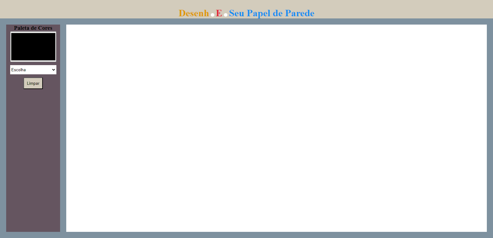

# Project Drawing 

Odin Project curriculum project, where the goal was to create an application that allows users to draw. Within the project, users can easily select colors from the palette, choose between free drawing mode or predefined shapes like rectangles and circles, and erase drawings either partially by hovering over them or completely.

📧 Send me an email: henrykaua21@gmail.com 

🔗 Connect with me on [LinkedIn](https://www.linkedin.com/in/henry-kaua/)

🐛 Open an [issue](https://github.com/henrymzs/drawing/issues) in the repository 

Any help is greatly appreciated and contributes to my growth as a developer. 🚀

Result:

